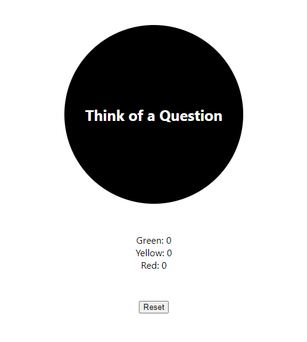

# React - Magic Eight Ball
Simple app emulating the classic Magic Eight Ball. "Ask" a question, click on the Eight Ball, and then it will auto-generate one of the classic Eight Ball responses. The color will correspond to the favorability of the response. This app was a practice with state control and component rendering. It tracks the number of times each response "color" populates. I also practiced event handling in React with this app.

     

## Running the App
1) Clone repo: `git clone https://github.com/mpike91/React-Blackjack.git`
2) Move into directory: `cd React-Blackjack/`
3) Install npm: `npm install`
4) Start app: `npm start`

## My Contribution
No starter code was provided. The entire app was written by me.
